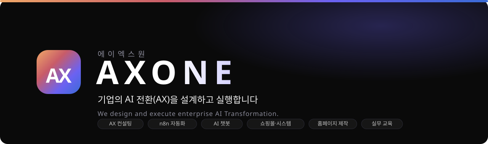

<div align="center">



**에이엑스원(AXONE) · AI 업무 자동화, 기업형 챗봇, 웹·시스템 개발과 AX 컨설팅**

[홈페이지](https://axone.ai.kr) · [서비스와 제공 범위](https://axone.ai.kr/services) · [가격](https://axone.ai.kr/pricing) · [데모](https://axone.ai.kr/projects) · [무료 상담](https://axone.ai.kr/contact)

</div>

## 이 저장소에서 확인할 수 있는 것

AXONE 공식 웹사이트의 소스코드입니다. 서비스 안내, 가격 계산, 상담 신청과 자체 제작 데모를 함께 제공합니다. 고객사 납품 실적이나 실제 매출·업무 개선 성과를 나타내는 저장소는 아닙니다.

- 서비스별 제공 범위, 산출물 예시와 착수 전에 합의할 운영 기준
- 초기 비용과 월 운영비를 구분하는 견적 계산
- 서비스·프로젝트 선택을 이어받는 상담 신청과 서버의 문의 검증
- 공개 데모 19개의 사용 흐름과 문서화된 체험 범위
- 검색엔진이 읽을 수 있는 서비스 상세, 구조화 데이터와 사이트맵

## 프로젝트 공개 상태

사이트의 표시와 같은 기준을 사용합니다. **데모 체험 가능**은 사용 흐름을 직접 조작할 수 있다는 뜻이며, 실제 고객 환경에 연결된 운영 서비스라는 뜻은 아닙니다.

| 상태 | 프로젝트 | 확인 방법 |
|---|---|---|
| 데모 체험 가능 | 자동화·AI 앱·웹·커머스·생산성·주식·금융 데모 19개 | [프로젝트 목록](https://axone.ai.kr/projects)에서 각 데모의 체험 범위 확인 |
| 소개 공개 · 체험 준비 | AI 블로그 포스팅 | 사이트에서 기능 소개 확인, 체험 링크 준비 중 |
| 소개 공개 · 체험 준비 | 팀 캘린더 | 사이트에서 기능 소개 확인, 체험 링크 준비 중 |
| 소개 공개 · 체험 준비 | 구글시트 → 텔레그램 리드 알림 | 사이트에서 기능 소개 확인, 체험 링크 준비 중 |

공개 데모는 예시 데이터와 일부 외부 조회를 사용합니다. 실제 주문·결제·발송을 수행하지 않는 화면이 있으며, AI 생성 사진도 포함합니다. 적용 가능한 기능과 연동 범위는 각 데모 상단의 안내와 상담에서 확인합니다.

| 데모 종류 | 체험 링크 |
|---|---|
| 문서·업무 자동화 | [OCR 추출 시연](https://axone.ai.kr/lab/ocr-extractor) · [자동화 템플릿](https://axone.ai.kr/lab/n8n-templates) · [정부지원사업](https://axone.ai.kr/lab/gov-support-finder) |
| AI 앱 | [사내 지식 챗봇](https://axone.ai.kr/lab/rag-chatbot) · [이력서 스크리너](https://axone.ai.kr/lab/resume-screener) · [에이전트 스타터](https://axone.ai.kr/lab/langgraph-starter) |
| 웹·커머스 | [기업 홈페이지](https://axone.ai.kr/lab/corporate-site) · [화장품 쇼핑몰](https://axone.ai.kr/lab/shop-cosmetics) · [의류 쇼핑몰](https://axone.ai.kr/lab/shop-fashion) |
| 생산성·콘텐츠 | [한글문서 초안](https://axone.ai.kr/lab/hwp-generator) · [개인 브랜딩](https://axone.ai.kr/lab/personal-branding) · [뉴스레터](https://axone.ai.kr/lab/ai-newsletter) |
| 데이터·금융 | [부동산 매물](https://axone.ai.kr/lab/realestate-scraper) · [주식 대시보드](https://axone.ai.kr/lab/stock-dashboard) · [백테스팅](https://axone.ai.kr/lab/backtester) |

## 구현에 사용한 기술

| 기술 | 이 사이트에서의 역할 |
|---|---|
| Next.js 15 · React 19 · TypeScript | 페이지·데모 UI, 정적 서비스 상세와 서버 API |
| CSS · SUIT Variable · Lucide | 반응형 화면, 한글 글꼴, 일관된 선형 아이콘 |
| Anthropic SDK | 일부 AI 데모 API의 모델 연동 |
| Mailgun | 상담 접수 메일 전달 |
| Vercel | 프로덕션 배포 |
| Simple Icons | 기술 도구 로고 |

Next.js의 정적 렌더링으로 서비스 내용을 초기 HTML에 제공하고, 가격과 문의 API는 같은 가격 데이터를 사용합니다. OCR 시연의 인식 테두리는 실제 텍스트 영역을 따라 그려 글꼴·줄바꿈 변화에 대응합니다.

PydanticAI, Claude Agent SDK, LangGraph 등 업무별 도입 기술 선택지는 [챗봇 서비스 안내](https://axone.ai.kr/services/chatbot)에서 확인할 수 있습니다. 이 저장소의 실제 의존성과 버전은 [package.json](package.json)에 명시되어 있습니다.

## 프로젝트 구조

```text
app/
  services/[slug]/   서비스별 상세와 산출물 안내
  guides/           AI 도입 가이드
  lab/              자체 제작 데모 19개
  api/contact/      입력 검증·견적 계산·문의 메일
  llms.txt/         회사·서비스 데이터에서 생성하는 안내 파일
components/         가격 계산·상담·공통 UI·전환 이벤트
lib/                가격·서비스·프로젝트·산출물 데이터
public/             이미지·아이콘·글꼴
tests/             가격·문의 회귀 검사
tooling/           글꼴 최적화 도구
docs/              구현·검증·운영 기록
```

## 로컬 실행과 검증

Node.js 24에서 빌드와 테스트를 확인했습니다.

```bash
npm ci
cp .env.example .env.local
npm run dev
```

Windows PowerShell에서는 `Copy-Item .env.example .env.local`을 사용합니다. 환경 변수의 설명은 [.env.example](.env.example)을 참고하세요. Mailgun 설정이 없으면 작성한 문의를 이메일 초안으로 정리하고, 사용자가 메일 앱에서 발송하는 방식으로 안내합니다. 서버 접수는 발송 설정 후 활성화됩니다.

```bash
npm test
npm run build
```

문의 자동 검사는 메일 제공자를 대체해 수행하며 실제 메일을 보내지 않습니다.

## 상담 전환 측정

서비스 선택, 데모 열람·조작, 상담 작성 시작·제출·접수 완료를 별도 이벤트로 구분합니다. Google Analytics 측정 ID를 `NEXT_PUBLIC_GA_ID`에 설정하면 GA4 전송이 활성화됩니다. **측정 ID가 없으면 외부 분석 서비스로 전송하지 않습니다.** 이름·이메일·전화·문의 내용은 분석 이벤트에 포함하지 않습니다.

이벤트 정의와 연결 절차는 [상담 흐름 개선 기록](docs/customer-flow-review.md)을 참고하세요.

## 회사 정보

| 항목 | 내용 |
|---|---|
| 회사명 | 에이엑스원(AXONE) |
| 대표 | 이원희 |
| 설립 | 2022. 07. 11. |
| 소재지 | 서울특별시 영등포구 국회대로66길 17, 10층 |
| 문의 | [axone042@gmail.com](mailto:axone042@gmail.com) · [상담 신청](https://axone.ai.kr/contact) |

이 저장소는 포트폴리오·참고 목적으로 공개합니다. 글꼴·로고 등 외부 자산의 출처와 라이선스는 각 자산 디렉터리에 보관합니다.
